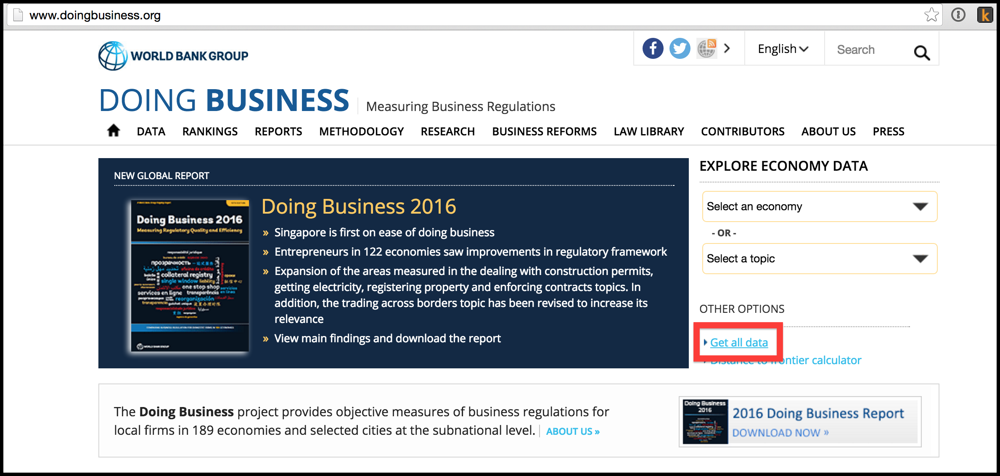
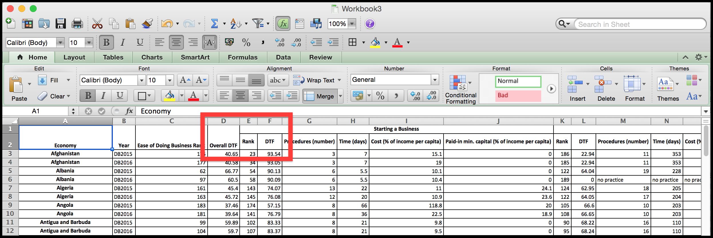
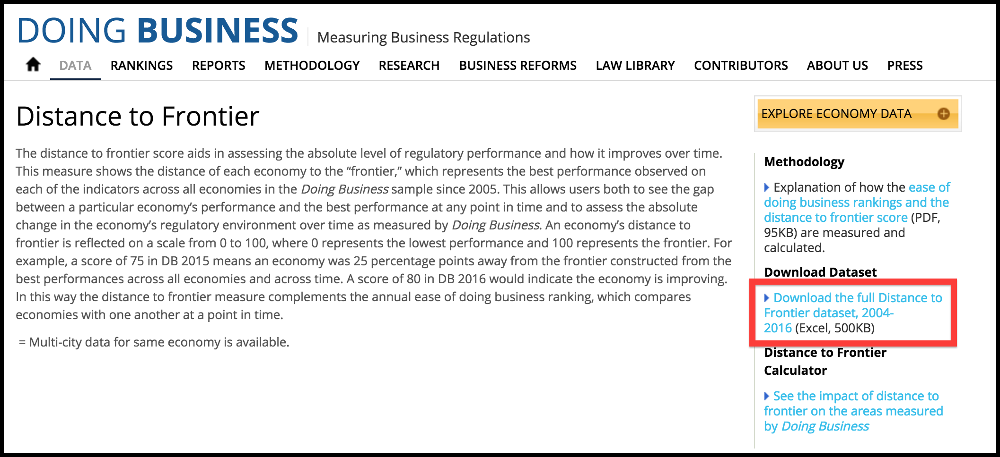

# Attempting to reproduce Figure 1.2 from Doing Business 2016

[Report](http://www.doingbusiness.org/reports/global-reports/doing-business-2016) chosen as a recent high profile WBG output. Below is the first data figure in the report.

Suppose I wanted to dig into this chart. For example, to figure out which countries look better under the new methodology vs. which countries look worse (ie. which side of the 45 degree line are they on). How hard would it be to reproduce?

## Falling at the first hurdle

The figure shows data from DB2016, calculated using two different methodologies. Unfortunately the site doesn't seem to publish the DB2016 data using the old methodology. So instead I will compare DB2016 using the new methodology with DB2015 using the old methodology.

## Getting data

The figure caption doesn't link back to the data

So far so good. Customize the data download.

Download as an Excel file. We can work with this.

Merged cells are going to make this painful to import. CSV option would have been nice.

What? It turns out this is not XLS format, but HTML table saved with a ".xls" extension. Excel handles this smoothly but it's a hack. We can use the XML package to read this, but let's step back and see if we can find a better file.

Ok this is better, it's exactly what I want. And, as a bonus, hidden on the second sheet it has the previous methodology. Jackpot!

## Creating chart

The R code to create the chart is less than 50 lines, of which about half is loading and manipulating, and half is formatting the chart.

Code here: https://github.com/econandrew/wbg-rr/blob/master/db16-fig1.2butnot.R

## How the chart could have been presented

*Source:* Doing Business database [[code to reproduce](https://github.com/econandrew/wbg-rr/blob/master/db16-fig1.2butnot.R)].

*Note:* The figure compares distance to frontier scores based on DB2015 data computed using the old (Doing Business 2015) methodology with scores based on the DB2016 data computed using the new methodology. The differences between the two series are in dealing with construction permits, getting electricity, registering property, protecting minority investors, trading across borders and enforcing contracts. The 45-degree line shows where the scores under the old and new methodologies are equal. The correlation between the two scores is 0.95.
